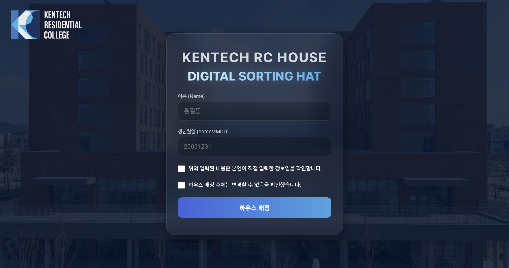
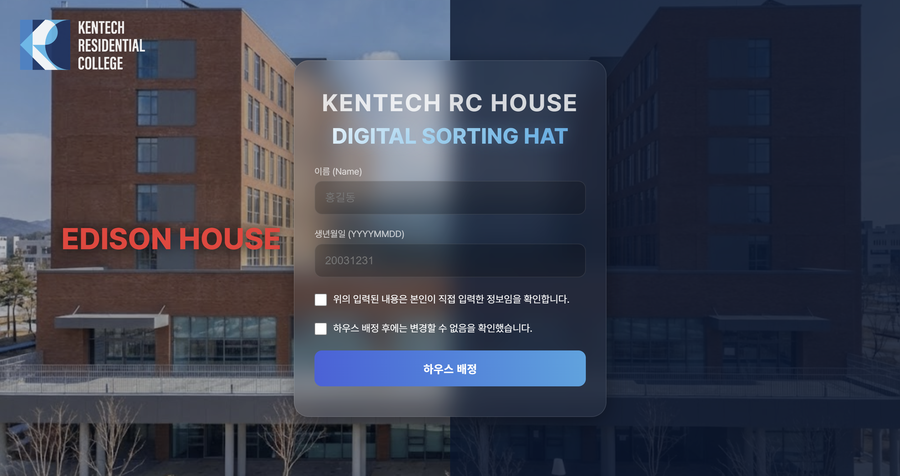
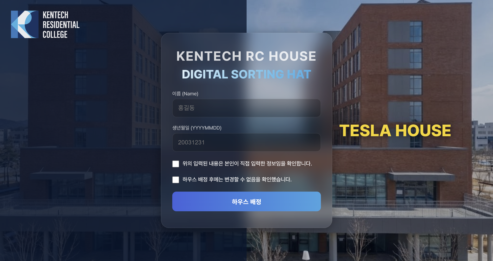
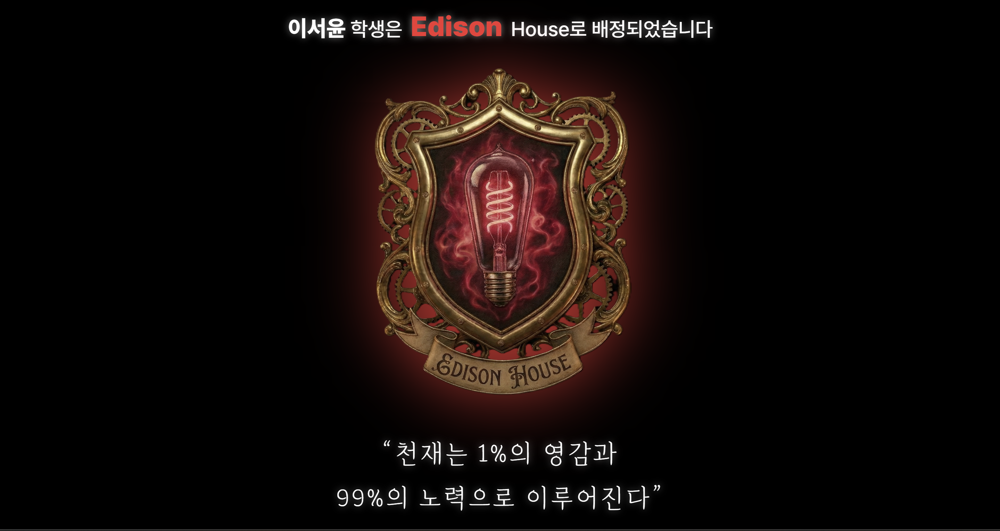
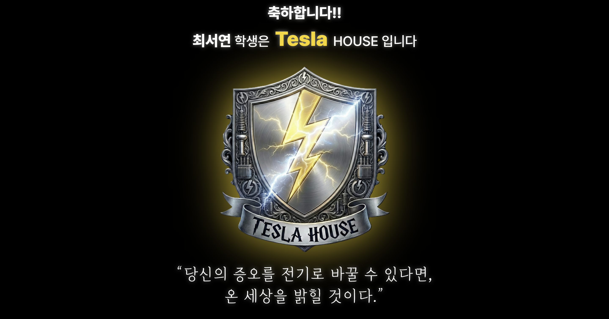
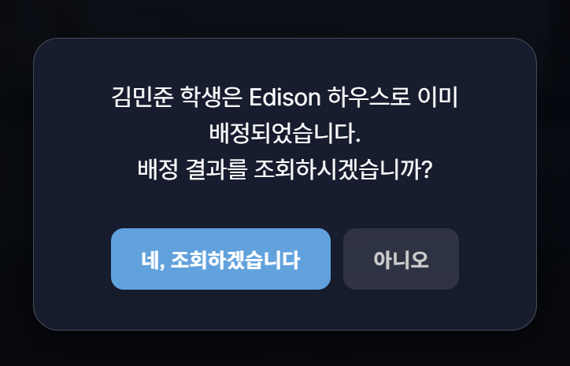
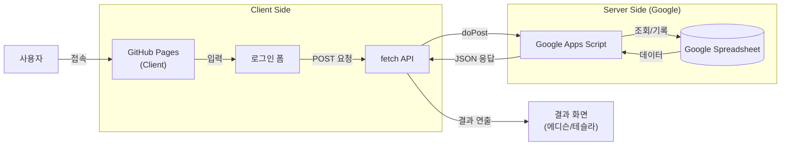

# KENTECH Digital House Sorting (RCHouseDraw)

<div align="center">


### KENTECH 신입생들을 위한 디지털 기숙사 배정 시스템

**"당신의 에너지가 이끄는 하우스는 어디입니까?"**

[](https://developer.mozilla.org/en-US/docs/Web/JavaScript)
[](https://developer.mozilla.org/en-US/docs/Web/HTML)
[](https://developer.mozilla.org/en-US/docs/Web/CSS)
[](https://developers.google.com/apps-script)

</div>

---

## 목차

1. [프로젝트 소개](#프로젝트-소개)
2. [배포 링크](#배포-링크)
3. [주요 기능](#주요-기능)
4. [기술 스택](#기술-스택)
5. [프로젝트 구조](#프로젝트-구조)
6. [아키텍처 설계](#아키텍처-설계)
7. [실행 방법](#실행-방법)

---

## 프로젝트 소개

> 밋밋한 엑셀 파일 확인이나 종이 뽑기는 이제 그만!

KENTECH Digital House Sorting은 신입생들에게 **마법 같은 기숙사 배정 경험**을 제공하기 위해 개발된 웹 애플리케이션입니다. 해리포터의 '기숙사 배정 모자'에서 영감을 받아, **고민하는 소팅 햇 애니메이션**, **신비한 연기 효과**, 그리고 영화 같은 연출을 통해 단순한 '확인' 과정을 하나의 '이벤트'로 만들었습니다.

| 문제 | 해결 |
|------|------|
| 지루한 배정 확인 | 시각적인 즐거움, 전율이 흐르는 결과 화면 연출 |
| 수동적인 데이터 관리 | Google Apps Script를 활용한 자동 성비 균형 배정 및 실시간 기록 |
| 정보 접근성 부족 | 언제 어디서나 접속 가능한 모바일 최적화 웹 서비스 |

---

## 배포 링크

| 항목 | 링크 |
|------|------|
| 배포 URL | [KentechRC/RCHouseDraw](https://kentechrc.github.io/RCHouseDraw/) |
| GitHub | [KentechRC/RCHouseDraw Repository](https://github.com/KentechRC/RCHouseDraw) |

---

## 화면 설계 (Screen Design)

### 1. 인터랙티브 인트로 (Interactive Intro)
사용자가 배경의 기숙사 건물과 상호작용하며 시각적인 즐거움을 느낄 수 있도록 설계했습니다.

| 중앙 (Default) | 왼쪽 호버 (Edison) | 오른쪽 호버 (Tesla) |
|:---:|:---:|:---:|
|  |  |  |

### 2. 로딩 및 결과 (Loading & Result)
**3D 소팅 햇(Sorting Hat)**이 등장하여 고민하는 듯한 애니메이션과 함께, 자욱한 안개 효과가 더해져 긴장감을 고조시킵니다.

| 로딩 화면 | 에디슨 배정 | 테슬라 배정 |
|:---:|:---:|:---:|
|  |  |  |

### 3. 모달창 (Modal)
이미 배정된 사용자가 다시 배정을 시도할 경우, 기존 배정 여부를 안내하는 모달창이 표시됩니다.

| 모달창 화면 |
|:---:|
|  |

---

## 주요 기능

### 1. 시네마틱 인트로 & UI
**글래스모피즘(Glassmorphism)** 디자인을 적용하여 현대적이고 고급스러운 느낌을 주었으며, 배경에는 흐르는 별 애니메이션을 적용하여 신비로운 분위기를 연출했습니다.

### 2. 인터랙티브 배경 (Background Interaction)
PC 화면에서는 배경의 건물(기숙사)과 상호작용할 수 있습니다.
- **Hover Effect**: 마우스를 올리면 해당 하우스 구역이 밝아지며 이름이 나타납니다.

### 3. 실시간 하우스 배정 (Sorting API)
사용자의 이름과 생년월일을 입력하면 Google Apps Script(GAS)를 통해 서버 통신이 이루어집니다.
- **성비 균형 유지**: 실시간으로 남/녀 성비를 계산하여 하우스를 배정합니다.
- **중복 배정 방지**: 이미 배정받은 내역이 있는 경우, **모달창**을 통해 안내 메시지를 띄우고 기존 배정 결과 화면으로 이동할지 사용자의 의사를 묻습니다.
- **이중 동의 시스템**: 두 개의 체크박스를 통해 배정 결과의 최종성을 명확히 인지시킵니다.
- **IP 로깅**: 배정 시 사용자의 IP 주소를 기록하여 부정 사용을 방지합니다.

### 4. 반응형 디자인 (Mobile Optimized)
모바일 환경에서도 최적의 경험을 제공합니다.
- 모바일 전용 배경 이미지 자동 적용
- 터치 환경을 고려한 레이아웃 자동 조정 (체크박스 정렬, 폰트 크기 등)

---

## 기술 스택

<div align="center">

| 구분 | 기술 |
|:----:|:----:|
| **Frontend** |    |
| **Backend** | Google Apps Script (Serverless) |
| **Database** | Google Spreadsheets |
| **Hosting** | GitHub Pages |

</div>

---

## 프로젝트 구조

```
RCHouseDraw/
├── index.html          # 메인 페이지 (UI 구조)
├── style.css           # 전체 스타일링 (애니메이션, 반응형 포함)
├── main.js             # 프론트엔드 로직 (이벤트 처리, API 호출, 연출)
├── apps.js             # 백엔드 로직 (Google Apps Script 소스 코드)
├── README.md           # 프로젝트 문서
└── src/                # 이미지 및 리소스 폴더
    ├── RC-logo.svg
    ├── 기숙사.png
    ├── 기숙사-모바일.png
    ├── 에디슨 로고.png
    └── 테슬라 로고.png
```

---

## 아키텍처 설계

이 프로젝트는 별도의 복잡한 백엔드 서버 구축 없이, **Google Apps Script**를 활용하여 Serverless 아키텍처를 구현했습니다.



---

## 실행 방법

### 1. 저장소 클론

```bash
git clone https://github.com/KentechRC/RCHouseDraw.git
cd RCHouseDraw
```

### 2. 로컬 실행
별도의 빌드 과정 없이 `index.html` 파일을 브라우저에서 열거나, Live Server 등을 이용해 실행할 수 있습니다.

> **Note**: API 통신은 Google Apps Script 배포 URL(`API_URL`)에 의존하므로, 인터넷 연결이 필요합니다.

---

<div align="center">

Made for **KENTECH RC**

</div>
